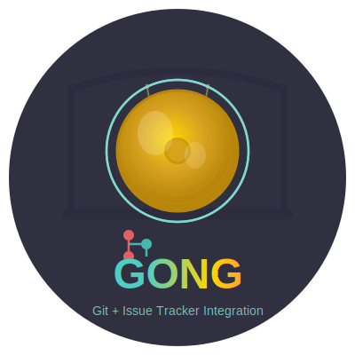

# Gong

<div align="center">
  
  <p><strong>A command-line tool for seamless Git and issue tracker integration</strong></p>

  [](https://github.com/KensoDev/gong/actions)
  [](https://goreportcard.com/report/github.com/KensoDev/gong)
  [](LICENSE)
  [](go.mod)
  [](https://github.com/KensoDev/gong/releases)
</div>

---

## Overview

**Gong** is a CLI tool that bridges the gap between issue trackers and Git workflows. Stay in your terminal and maintain your development flow while working with Jira and other project management tools.

**Key Features:**
- Create Git branches directly from issue IDs with proper naming conventions
- Automatically transition issues to "started" state
- Comment on issues via stdin pipes (perfect for sending diffs or file contents)
- Link commits to issues via Git hooks
- Browse issues in your default browser from the command line

## Usage

## Installation

### Pre-built Binaries

Download the latest release from [GitHub Releases](https://github.com/KensoDev/gong/releases) for your platform:

- macOS (Darwin)
- Linux
- Windows (community tested)

Place the binary in your `PATH` and make it executable:

```bash
# Example for macOS/Linux
chmod +x gong
sudo mv gong /usr/local/bin/
```

### From Source

```bash
go install github.com/KensoDev/gong/cmd/gong@latest
```

### Using Homebrew (macOS/Linux)

```bash
# Coming soon
brew install gong
```

## Supported Issue Trackers

| Tracker | Status | Notes |
|---------|--------|-------|
| Jira | ✅ Full support | Username/password or API token |

**Want to add support for another tracker?** Contributions are welcome! The codebase uses a generic `Client` interface that makes adding new trackers straightforward.

### Login

In order to use `gong` you first you need to login.

`gong login {client-name}`

Each of the supported clients will prompt the required fields in order to login to the system. Jira will need username, pass and a couple more while others might only need an API token.

Once you input all of the details the client will attempt to login. If succeeded it will let you know.

[](https://asciinema.org/a/dcko3kv5xwobpf4rgj0e4ulyo)

### Start working on an issue

`gong start {issue-id} --type feature`

If you want to start working on an issue, you can type in `gong start` with the
issue id and what type of work is this (defaults to feature).

This will do a couple of things

1. Create a branch name `{type}/{issue-id}-{issue-title-sluggified}`
2. Transition the issue to a started state

[](https://asciinema.org/a/c5libsysjmb5f8f8gizkbldzv)

### `gong browse`

While working on a branch that matches the gong regular expression (look
above), you can type `gong browse` and it will open up a browser opened on the
issue automatically.

### `gong comment`

While working on a branch that matches the gong regular expression, you can
type `echo "comment" | gong comment` and it will send a comment on the ticket.

### Why a pipe?

The reason for choosing a pipe and not just have the comment as an argument is to have the ability to send **any** output to the comment.

What I find most useful is to send diffs, files, buffers from vim and more.

With this approach, I find I write much better comments to tickets. You will do the same :)

](https://asciinema.org/a/d0rcjavbv55lbq1xpsrqiyyu6)

### `gong prepare-commit-message`

This is **not** meant to be used directly, instead it is meant to be wrapped with simple wrapper git hooks.

Sample hooks can be found in `git-hooks` directory.

All you need to do is to copy them into your `.git/hooks` directory.

This will add a link to the issue to every commit. Whether you do `git commit "commit message" or edit the commit message using the editor with `git commit`

### Install commit hooks on your repository

```bash
curl https://raw.githubusercontent.com/KensoDev/gong/main/git-hooks/prepare-commit-msg > .git/hooks/prepare-commit-msg
chmod +x .git/hooks/prepare-commit-msg

curl https://raw.githubusercontent.com/KensoDev/gong/main/git-hooks/commit-msg > .git/hooks/commit-msg
chmod +x .git/hooks/commit-msg
```

### `gong create`

Gong create will open the browser on the issue tracker create ticket flow. You
can then copy over the issue-id and run `gong start` which will create the
branch and you cn start working on your ticket.

## Issues/Feedback

If you have any issues, please open one here on Github or hit me up on twitter [@KensoDev](https://twitter.com/KensoDev)

## Development

### Building from Source

```bash
# Clone the repository
git clone https://github.com/KensoDev/gong.git
cd gong

# Build the project
make build

# Run tests
make test

# See all available commands
make help
```

### Contributing

Contributions are welcome! Please feel free to submit a Pull Request. For major changes, please open an issue first to discuss what you would like to change.

1. Fork the repository
2. Create your feature branch (`git checkout -b feature/amazing-feature`)
3. Commit your changes (`git commit -m 'Add some amazing feature'`)
4. Push to the branch (`git push origin feature/amazing-feature`)
5. Open a Pull Request

### Project Structure

```
gong/
├── cmd/gong/          # Main CLI application
├── assets/            # Logo and visual assets
├── git-hooks/         # Sample Git hooks
├── client.go          # Generic client interface
├── jira.go           # Jira client implementation
└── slugger.go        # Branch name slugification
```

## License

This project is licensed under the MIT License - see the [LICENSE](LICENSE) file for details.

## Acknowledgments

- Original author: [Avi Zurel](https://github.com/KensoDev)
- Inspired by the need for seamless Git and issue tracker workflows

## Changelog

### 1.7.0 (2025)
- **BREAKING:** Removed Pivotal Tracker support (Pivotal Tracker has been discontinued)
- Modernized Go tooling (Go 1.23)
- Replaced deprecated `ioutil` package
- Added GitHub Actions CI/CD
- Added Makefile for build automation
- Improved README with badges and better structure
- Added new logo and branding
- Migrated from Travis CI to GitHub Actions
- Changed default branch from `master` to `main`

### 1.6.0
- Added transitions to the config and outputting the transitions to stdout

### 1.3.4
- Added `create` command to open browser on create ticket URL

## Support

- Issues: [GitHub Issues](https://github.com/KensoDev/gong/issues)
- Twitter: [@KensoDev](https://twitter.com/KensoDev)

