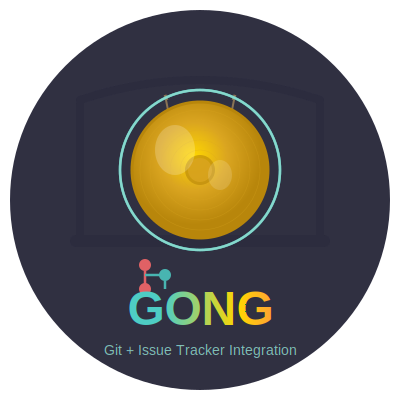

# Gong

<div align="center">
  
  <p><strong>A command-line tool for seamless Git and issue tracker integration</strong></p>

  [](https://github.com/KensoDev/gong/actions)
  [](https://goreportcard.com/report/github.com/KensoDev/gong)
  [](LICENSE)
  [](go.mod)
  [](https://github.com/KensoDev/gong/releases)
</div>

---

## Overview

**Gong** is a CLI tool that bridges the gap between issue trackers and Git workflows. Stay in your terminal and maintain your development flow while working with Jira and other project management tools.

**Key Features:**
- 🎯 **Create issues interactively** with a minimal TUI - no browser needed
- 🌿 **Auto-create Git branches** with proper naming conventions (`feature/PROJ-123-issue-title`)
- 🔗 **Auto-link commits to issues** with intelligent git hook installation
- 🚀 **Transition issues** to "started" state automatically
- 💬 **Comment on issues** via stdin pipes (perfect for sending diffs or file contents)
- 🌐 **Browse issues** in your default browser from the command line
- ✏️ **Multi-line descriptions** using your preferred editor

## Quick Start

```bash
# 1. Install gong
go install github.com/KensoDev/gong/cmd/gong@latest

# 2. Login to your JIRA instance
gong login jira

# 3. Create a new issue interactively
gong create OPS
# - Select issue type (Bug, Story, Task, etc.)
# - Enter summary
# - Add description (opens your editor)
# - Branch created automatically!

# 4. All your commits will now include the JIRA ticket link!
git commit -m "Implement new feature"
# Result: "Implement new feature\n\n[OPS-123](https://your-jira.com/browse/OPS-123)"
```

## Installation

### Pre-built Binaries

Download the latest release from [GitHub Releases](https://github.com/KensoDev/gong/releases) for your platform:

- macOS (Darwin)
- Linux
- Windows (community tested)

Place the binary in your `PATH` and make it executable:

```bash
# Example for macOS/Linux
chmod +x gong
sudo mv gong /usr/local/bin/
```

### From Source

```bash
go install github.com/KensoDev/gong/cmd/gong@latest
```

### Using Homebrew (macOS/Linux)

```bash
# Coming soon
brew install gong
```

## Supported Issue Trackers

| Tracker | Status | Notes |
|---------|--------|-------|
| Jira | ✅ Full support | Username/password or API token |

**Want to add support for another tracker?** Contributions are welcome! The codebase uses a generic `Client` interface that makes adding new trackers straightforward.

## Commands

### `gong login` - Authenticate with JIRA

Before using gong, you need to authenticate with your JIRA instance.

```bash
gong login jira
```

You'll be prompted for:
- **Username**: Your JIRA username or email
- **Domain**: Your JIRA instance (e.g., `yourcompany.atlassian.net`)
- **Password**: Your password or API token (recommended)
- **Project Prefix**: Default project key prefix (optional)
- **Transitions**: Comma-separated list of allowed issue transitions (e.g., `In Progress,Started`)

**Using API Tokens (Recommended):**
1. Go to https://id.atlassian.com/manage-profile/security/api-tokens
2. Create a new API token
3. Use the token as your password when logging in

[](https://asciinema.org/a/dcko3kv5xwobpf4rgj0e4ulyo)

### `gong start` - Start Working on Existing Issue

Start working on an existing JIRA issue.

```bash
gong start <ISSUE-ID> [--type <branch-type>]
```

**Examples:**
```bash
# Start working on a story/task (default: feature)
gong start PROJ-123

# Start working on a bug
gong start PROJ-456 --type bugfix

# Start working with custom branch type
gong start PROJ-789 --type hotfix
```

**What it does:**
1. Fetches the issue title from JIRA
2. Creates a branch: `{type}/{issue-id}-{slugified-title}`
3. Transitions the issue to "started" state (based on your configured transitions)
4. Checks out the new branch
5. Prompts to install git hooks (first time only)

**Example:**
```bash
gong start OPS-123 --type feature
# Creates branch: feature/OPS-123-implement-user-authentication
# Transitions OPS-123 to "In Progress"
# Checks out the branch
```

**Flags:**
- `--type`: Branch type prefix (default: `feature`)
  - Common types: `feature`, `bugfix`, `hotfix`, `chore`, `docs`
  - Or set `GONG_DEFAULT_BRANCH_TYPE` environment variable

[](https://asciinema.org/a/c5libsysjmb5f8f8gizkbldzv)

### `gong browse` - Open Issue in Browser

Opens the current issue in your default browser.

```bash
gong browse
```

**What it does:**
- Extracts the JIRA ticket ID from your current branch name
- Opens the issue in your default browser

**Example:**
```bash
# On branch: feature/OPS-123-new-feature
gong browse
# Opens: https://your-jira.atlassian.net/browse/OPS-123
```

### `gong comment` - Add Comments via Pipe

Add comments to the current issue by piping content through stdin.

```bash
<command> | gong comment
```

**Why a pipe?**
This design allows you to send **any** output directly to JIRA comments:
- Git diffs
- File contents
- Command outputs
- Vim buffers
- Test results

**Examples:**
```bash
# Send a simple message
echo "Fixed the authentication bug" | gong comment

# Send git diff
git diff | gong comment

# Send file contents
cat error.log | gong comment

# Send test results
npm test | gong comment

# From vim: select lines and run
:'<,'>!gong comment
```

**What it does:**
- Extracts ticket ID from current branch name
- Posts the piped content as a comment to the JIRA issue
- Preserves formatting (great for code snippets and logs)

](https://asciinema.org/a/d0rcjavbv55lbq1xpsrqiyyu6)

### `gong install-hooks` - Auto-Link Commits to Issues ✨ **NEW**

Automatically install git hooks that add JIRA ticket links to every commit.

```bash
gong install-hooks
```

**What it does:**
- Installs `prepare-commit-msg` hook in `.git/hooks/`
- Automatically extracts ticket ID from branch name
- Adds JIRA link to every commit message
- **Smart installation**: Appends to existing hooks instead of replacing them

**Automatic Installation:**
When you run `gong create` or `gong start` for the first time in a repo, you'll be prompted:
```
Git hook not installed. Install prepare-commit-msg hook to auto-add ticket IDs to commits? (y/n)
```

**Example:**
```bash
# On branch: feature/OPS-123-new-feature
git commit -m "Implement authentication"

# Commit message becomes:
# Implement authentication
#
# [OPS-123](https://your-jira.atlassian.net/browse/OPS-123)
```

**Manual Installation (Alternative):**
```bash
curl https://raw.githubusercontent.com/KensoDev/gong/main/git-hooks/prepare-commit-msg > .git/hooks/prepare-commit-msg
chmod +x .git/hooks/prepare-commit-msg
```

**Note:** If you already have a `prepare-commit-msg` hook, gong will append its logic to preserve your existing hooks.

### `gong prepare-commit-message`

This command is used internally by the git hook. You typically don't need to run it directly.

It extracts the JIRA ticket ID from your branch name and formats it as a markdown link.

### `gong create` - Create Issues Interactively ✨ **NEW**

Create JIRA issues directly from your terminal with an interactive TUI.

```bash
gong create <PROJECT-KEY>
```

**Example:**
```bash
gong create OPS
```

**Interactive Workflow:**
1. **Select Issue Type**: Choose from Bug, Story, Task, Epic, etc.
2. **Enter Summary**: One-line title for the issue
3. **Add Description**: Press Enter to open your editor (`$EDITOR` or vim) for multi-line descriptions
4. **Issue Created**: JIRA issue created automatically
5. **Branch Created**: Git branch created and checked out with format `{type}/{ISSUE-ID}-{slugified-title}`
6. **Git Hook Installed**: On first use, prompts to install commit hooks for auto-linking

**Branch Type Mapping:**
- Bug/Defect → `bugfix/`
- Story/Task/Feature → `feature/`
- Epic → `epic/`
- Improvement/Enhancement → `enhancement/`
- Sub-task → `task/`

**Example Output:**
```
Select issue type
▸ Task
  Story
  Bug
  Epic

Summary: Implement user authentication
Description (optional, press Enter to skip): [Opens editor]

Creating issue...
✓ Created issue: OPS-123
✓ Created and checked out branch: feature/OPS-123-implement-user-authentication
Success! Now working on branch: feature/OPS-123-implement-user-authentication
```

**Environment Variables:**
- `GONG_DEFAULT_BRANCH_TYPE`: Override branch type (e.g., `export GONG_DEFAULT_BRANCH_TYPE=custom`)
- `EDITOR`: Set your preferred editor for descriptions (default: vim)

---

## Complete Workflows

### Workflow 1: Create New Issue from Scratch

```bash
# Create issue interactively
gong create OPS
# 1. Select issue type (Bug, Story, Task...)
# 2. Enter summary
# 3. Add description (opens editor)
# 4. Issue created: OPS-456
# 5. Branch created: feature/OPS-456-your-issue-title
# 6. Git hook installed (prompts on first use)

# Make changes
vim src/feature.js

# Commit (ticket link added automatically!)
git commit -m "Implement feature"
# Result: "Implement feature\n\n[OPS-456](https://jira.com/browse/OPS-456)"

# Push and create PR
git push -u origin feature/OPS-456-your-issue-title
```

### Workflow 2: Work on Existing Issue

```bash
# Start working on existing issue
gong start OPS-789
# Creates: feature/OPS-789-existing-issue-title
# Transitions: OPS-789 to "In Progress"

# Make changes
vim src/bugfix.js

# View issue in browser
gong browse

# Send diff as comment
git diff | gong comment

# Commit
git commit -m "Fix the bug"
```

### Workflow 3: Bug Fix Workflow

```bash
# Create bug issue
gong create OPS
# Select: Bug
# Branch created: bugfix/OPS-999-fix-login-error

# Fix and test
vim src/auth.js
npm test

# Send test results to JIRA
npm test | gong comment

# Commit and push
git commit -m "Fix login error"
git push -u origin bugfix/OPS-999-fix-login-error
```

---

## Configuration

### Environment Variables

- `GONG_DEFAULT_BRANCH_TYPE`: Set default branch type
  ```bash
  export GONG_DEFAULT_BRANCH_TYPE=feature
  ```

- `EDITOR`: Set your preferred editor for multi-line descriptions
  ```bash
  export EDITOR=nvim  # or vim, nano, code --wait, etc.
  ```

### Config File Location

Credentials are stored in `~/.gong.json` with the following structure:
```json
{
  "client": "jira",
  "username": "your-email@company.com",
  "password": "your-api-token",
  "domain": "https://yourcompany.atlassian.net",
  "project_prefix": "OPS",
  "transitions": "In Progress,Started"
}
```

**Security Note:** Use JIRA API tokens instead of passwords. Never commit this file to version control.

---

## Issues/Feedback

If you have any issues, please open one here on Github or reach out on Twitter [@avi_zurel](https://twitter.com/avi_zurel)

## Development

### Building from Source

```bash
# Clone the repository
git clone https://github.com/KensoDev/gong.git
cd gong

# Build the project
make build

# Run tests
make test

# See all available commands
make help
```

### Contributing

Contributions are welcome! Please feel free to submit a Pull Request. For major changes, please open an issue first to discuss what you would like to change.

1. Fork the repository
2. Create your feature branch (`git checkout -b feature/amazing-feature`)
3. Commit your changes (`git commit -m 'Add some amazing feature'`)
4. Push to the branch (`git push origin feature/amazing-feature`)
5. Open a Pull Request

### Project Structure

```
gong/
├── cmd/gong/          # Main CLI application
├── assets/            # Logo and visual assets
├── git-hooks/         # Sample Git hooks
├── client.go          # Generic client interface
├── jira.go           # Jira client implementation
└── slugger.go        # Branch name slugification
```

## License

This project is licensed under the MIT License - see the [LICENSE](LICENSE) file for details.

## Acknowledgments

- Original author: [Avi Zurel](https://github.com/KensoDev)
- Inspired by the need for seamless Git and issue tracker workflows

## Changelog

### 2.0.0 (2026) - Major Release ✨

**New Features:**
- 🎯 **Interactive Issue Creation**: `gong create <PROJECT-KEY>` now creates issues interactively with a minimal TUI
  - Select issue type from available types
  - Prompt for required fields only
  - Multi-line description support using your default editor
  - Auto-creates branch with proper naming convention
  - Smart branch type mapping (Bug→bugfix, Story→feature, etc.)
- 🔗 **Automatic Git Hook Installation**: `gong install-hooks` command
  - Automatically prompted on first `gong create` or `gong start`
  - Smart installation: appends to existing hooks instead of replacing
  - Auto-links every commit to JIRA ticket
- 📝 **Enhanced Documentation**: Complete workflow examples and configuration guide
- ✅ **Comprehensive Test Suite**: 27 tests covering all new functionality

**Breaking Changes:**
- `gong create` now requires a project key argument and creates issues interactively (previously opened browser)

**Bug Fixes:**
- Fixed issue ID extraction from branch names with various formats
- Improved error messages with detailed JIRA API responses

**Internal:**
- Added `hooks.go` for git hook management
- Added `jira_create_test.go`, `hooks_test.go`, `integration_test.go`
- Updated CLI interface to support new create workflow

### 1.7.0 (2025)
- **BREAKING:** Removed Pivotal Tracker support (Pivotal Tracker has been discontinued)
- Modernized Go tooling (Go 1.23)
- Replaced deprecated `ioutil` package
- Added GitHub Actions CI/CD
- Added Makefile for build automation
- Improved README with badges and better structure
- Added new logo and branding
- Migrated from Travis CI to GitHub Actions
- Changed default branch from `master` to `main`

### 1.6.0
- Added transitions to the config and outputting the transitions to stdout

### 1.3.4
- Added `create` command to open browser on create ticket URL

## Support

- Issues: [GitHub Issues](https://github.com/KensoDev/gong/issues)
- Twitter: [@avi_zurel](https://twitter.com/avi_zurel)

